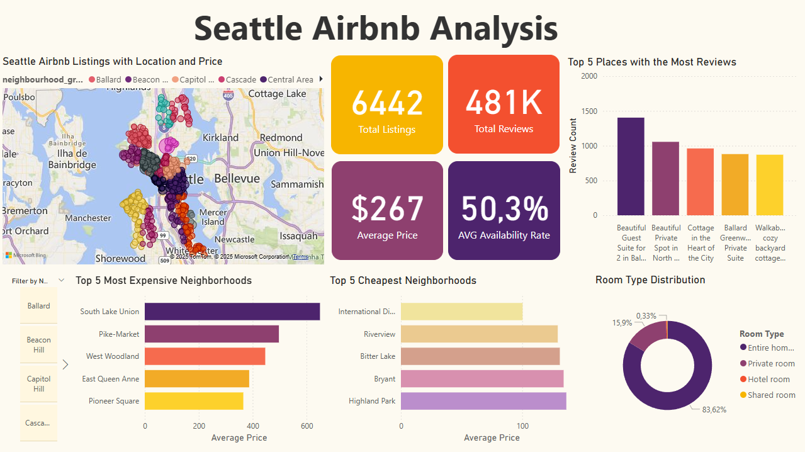

# Seattle Airbnb Analysis

## Overview

This project explores the Seattle Airbnb Open Data using SQL and Power BI to uncover patterns in pricing, availability, room types, and customer behavior through a practical, data-driven lens.

---

## Dataset

The dataset comes from [Seattle Airbnb Open Data](https://www.kaggle.com/datasets/swsw1717/seatle-airbnb-open-data-sql-project) on Kaggle. It contains three tables:

- `listings.csv`: property and host details
- `calendar.csv`: daily pricing and availability
- `reviews.csv`: guest reviews

**Note:** Due to GitHub file size limits, the full `calendar.csv` and `reviews.csv` files are not included in this repository.  
However, you can download them from the Kaggle page linked above.  
Sample versions of both tables are available in the `/data` folder for reference.

---

## Tools Used

- **SQL (PostgreSQL)** – For data cleaning and analysis
- **Power BI** – For interactive dashboard creation

---

## Steps

- **Table Creation** – Defined schema and imported raw data into PostgreSQL  
- **Data Cleaning** – Standardized price formats, handled missing values, removed irrelevant fields  
- **Individual Table EDA** – Explored patterns within `listings`, `calendar`, and `reviews` separately  
- **Table Joins & Combined Analysis** – Merged tables to enrich insights (e.g., price + availability + review behavior)  
- **SQL Integration with Power BI** – Custom queries pasted into Power BI via direct PostgreSQL connection  
- **Dashboard Creation** – Designed an interactive dashboard with slicers, KPIs, and visualizations

---

## Key Insights

- **Prices are stable year-round** — Despite common expectations of seasonal or weekend price surges, the Airbnb daily prices in Seattle appear highly consistent, suggesting either uniform demand or a tendency for hosts to standardize rates year-round.
  
- **Entire homes dominate** — Over 80% of listings are entire places. Private rooms are less common, and hotel/shared rooms are rare.

- **Listings are clustered in central areas** — Downtown, Capitol Hill, and the University District have the highest concentration.

- **Many listings use templated names** — Especially by companies like Blueground, which reuse titles across dozens of units.
  
- **Ballard stands out** — Notably, several of the most-reviewed listings are in Ballard, suggesting strong guest demand in that area

- **Review activity is booming** — The number of Airbnb reviews in Seattle has increased dramatically over the years. Although there was a drop in 2020 (likely due to the pandemic), activity quickly bounced back. With partial data, 2024 has already surpassed 52,000 reviews, pointing to strong and  ongoing demand.

---

## Dashboard Preview

This is a view of the final Power BI dashboard, featuring all the key metrics and charts used in the analysis.
- Interactive slicers by neighborhood groups.
- KPIs showing total listings, average price, and availability rate.
- Charts highlighting price trends, room type distribution, review growth, and top neighborhoods.

 ---
## Conclusion

This project offered a detailed exploration of Seattle’s Airbnb market using SQL and Power BI. The data revealed that the market is dominated by entire homes in central neighborhoods, with consistent pricing throughout the year and seasonal availability shifts .Guest engagement continues to grow, especially in residential areas like Ballard. 

By combining relational database queries with visual storytelling in Power BI, this project demonstrates how raw data can uncover meaningful, actionable insights in the short-term rental space.

Thank you for checking out my project!

